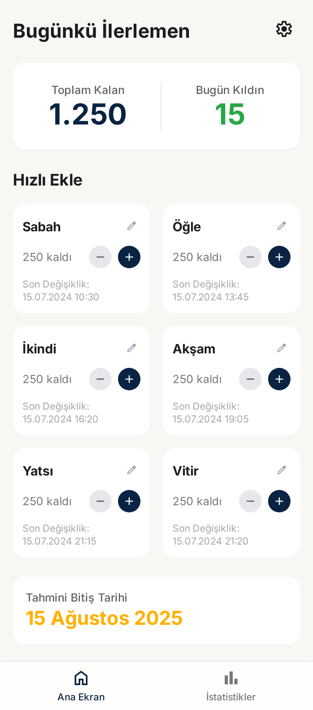
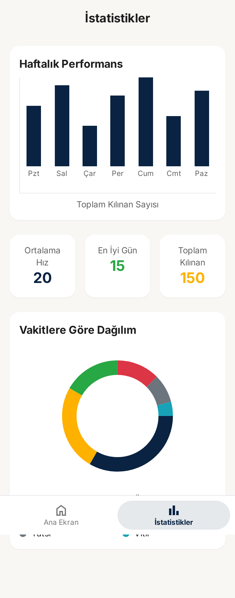
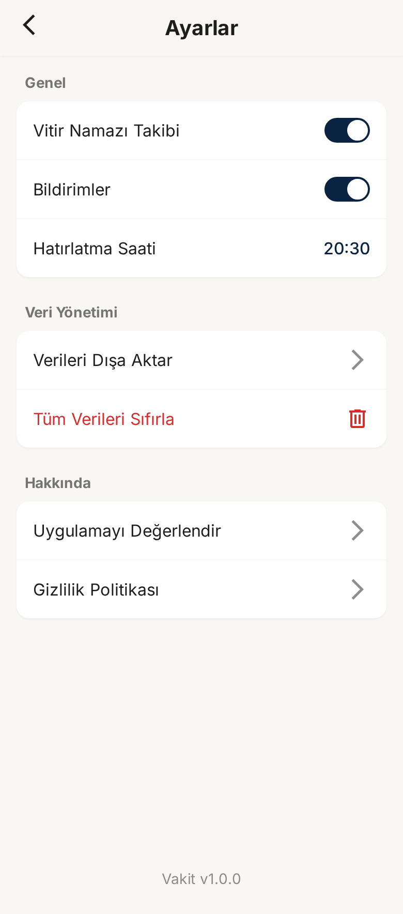
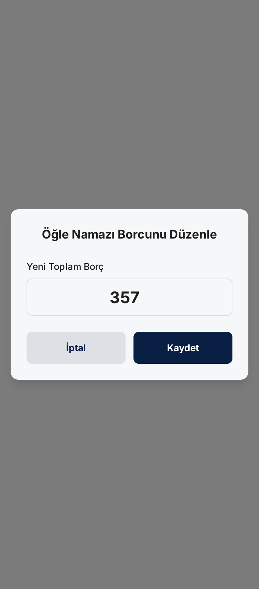

# Vakit

Vakit, kaza namazı borçlarını takip etmeyi kolaylaştıran, Jetpack Compose ile geliştirilen modern bir Android uygulamasıdır. Kullanıcı başlangıçta toplam borcunu hesaplar, günlük ilerlemesini kaydeder ve zaman içindeki performansını görselleştirir.

## Özellikler
- İlk açılışta borç hesaplamasını kolaylaştıran onboarding akışı
- Günlük borç ve tamamlanan namazları özetleyen gösterge paneli
- Namaz bazında ilerleme oranlarını ve trendleri sunan istatistik bölümü
- Hatırlatıcı, tema ve witr takibi gibi tercihler için ayarlar ekranı
- Material 3 bileşenleri ile modern, erişilebilir ve duyarlı arayüz

## Ekran Görüntüleri

| Dashboard | İstatistikler |
| :---: | :---: |
|  |  |

| Ayarlar | Borç Güncelleme |
| :---: | :---: |
|  |  |

## Mimari ve Teknolojiler
- **Mimari:** Clean Architecture + MVVM
- **UI:** Jetpack Compose (Material Design 3)
- **DI:** Hilt
- **Veri Katmanı:** Room, DataStore Preferences
- **Gezinme:** Navigation Compose
- **Async:** Kotlin Coroutines & Flow

### Katmanlı Yapı
```
UI (Compose ekranları) → ViewModel → Repository → Room DAO / DataStore
```

Bu yapı sayesinde UI katmanı yalın, test edilebilir ve yeniden kullanılabilir kalır.

## Proje Yapısı
```
app/
 └── src/main/java/com/halitbarut/vakit
     ├── data/              # Room entity/dao, repository implementasyonları
     ├── di/                # Hilt modülleri
     ├── domain/            # Use-case'ler, modeller ve repository arayüzleri
     ├── navigation/        # Navigation graph ve hedef tanımları
     └── ui/
         ├── components/    # Ortak Compose bileşenleri
         ├── screens/       # Onboarding, Dashboard, Statistics, Settings yüzeyleri
         └── theme/         # Material 3 tema yapılandırması
screens_reference/          # Google Stitch ile üretilen yüksek sadakatli ekran referansları
```

## Başlangıç
1. Android Studio Giraffe (veya daha güncel) ve JDK 17 kurulu olduğundan emin olun.
2. Depoyu klonlayın:
   ```bash
   git clone https://github.com/<kullanici>/Vakit.git
   cd Vakit
   ```
3. Bağımlılıkları senkronize etmek ve projeyi doğrulamak için aşağıdaki komutları çalıştırın:
   ```bash
   ./gradlew clean
   ./gradlew assembleDebug
   ```
4. Unit testleri çalıştırmak için:
   ```bash
   ./gradlew testDebugUnitTest
   ```
5. Compose yüzeyleri veya cihaz üzerinde test etmek için:
   ```bash
   ./gradlew connectedAndroidTest
   ```

## Ekran Referansları
UI tasarımları `screens_reference/` klasöründeki `code.html` dosyalarına dayanır. Onboarding, Dashboard, İstatistik ve Ayarlar ekranlarını geliştirirken bu referanslar temel alınmış, Material 3 ile zenginleştirilmiştir.

## Konfigürasyon ve Gizlilik
- `local.properties` dosyası makineye özel bilgileri içerdiğinden versiyon kontrolüne dahil edilmez.
- `.gitignore` Gradle çıktıları, IDE ayarları, derleme artefaktları ve olası gizli anahtarları (örn. `.env`, `*.jks`, `*.pem`) dışlayacak şekilde güncellendi.
- Depo taraması sonucunda API anahtarı veya gizli bilgi içeren dosya bulunmamıştır.

## Katkı
Katkı sağlamak isteyenler için önerilen adımlar:
1. Issue veya feature isteği açarak fikirlerinizi paylaşın.
2. Yeni bir dal oluşturup değişikliklerinizi işleyin.
3. Kodlama standartlarına uyduğunuzdan ve testleri çalıştırdığınızdan emin olun.
4. Pull Request oluştururken değişiklikleri, ekran görüntülerini ve test çıktılarını ekleyin.

## Lisans
Bu proje MIT Lisansı altında lisanslanmıştır. Daha fazla bilgi için [LICENSE](LICENSE) dosyasına bakın.
